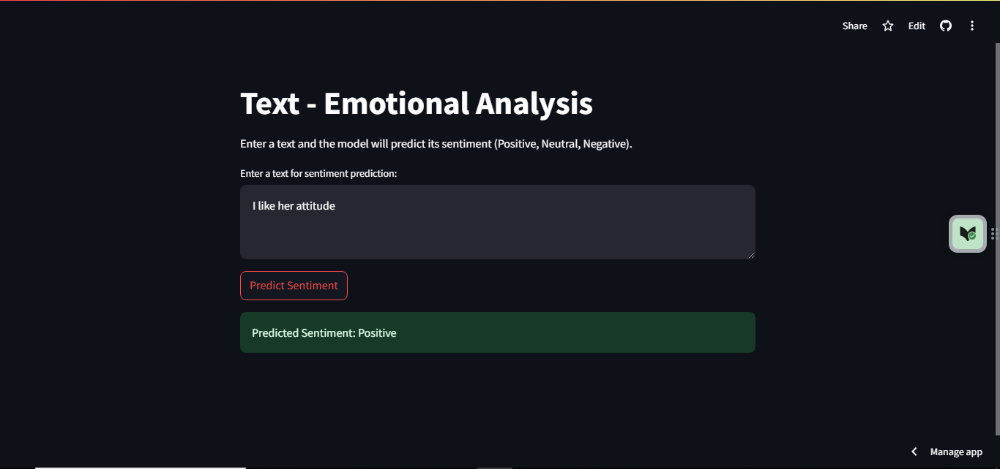
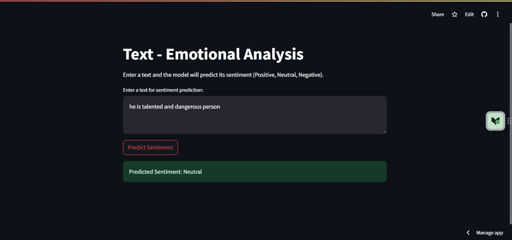
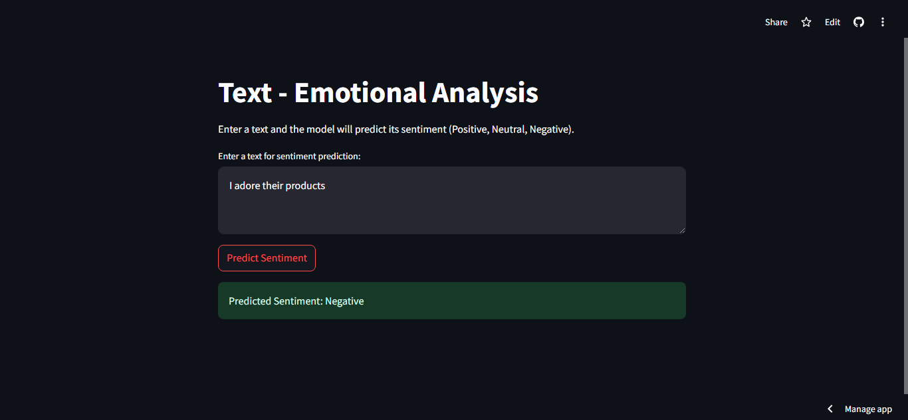

# Text Emotional Analysis with Streamlit 

This is a Streamlit application that allows users to enter a piece of text and predict its sentiment (Positive, Neutral, Negative) using a pre-trained Logistic Regression model.

## Demo WebApp

This app is up and running on Streamlit cloud server!!! Thanks 'Streamlit' for the community support for the cloud upload. You can check the demo of this web application on the link below.

[Text-Emotional-Analysis-With-Streamlit](https://github.com/Rajesh7094/Text_Emotional_Analysis.git)


###  If you have any doubt or want to contribute feel free to hit me up on (rajesherode2004@gmail.com)

## Text Emotional Analysis with Streamlit

**App Main Page**


**Positive Prediction**



**Neutral Prediction**



**Negative Prediction**



## Requirements
* Python 3.X

* pandas

* scikit-learn

* streamlit


## How to Run
* Clone the repository

```
$ git clone https://github.com/Rajesh7094/Text_Emotional_Analysis.git
```
* Setup Virtual Environment

```
$ python -m venv env
```
* Activate the virtual environment

```
$ env\Scripts\activate
```
* Install dependencies using

```
$ pip install -r requirements.txt
```
* Run Streamlit

```
$ streamlit run app.py
```
</br>

Live Demo link 
    https://rajesh7094-text-emotional-analysis-app-iynxcy.streamlit.app/


## Acknowledgements
If you have any doubt or want to contribute feel free to hit me up on (rajesherode2004@gmail.com)
The app uses the Streamlit(<https://github.com/streamlit/streamlit>) library for the user interface.**

